# UI Guidelines

Conventions for building and maintaining the JonaWhisper interface. Follow these rules when adding or modifying any view or component.

## Design system

The app uses a **glassmorphism** design language inspired by native macOS panels: translucent card backgrounds, subtle blurs, thin borders, and soft shadows. Components come from **shadcn-vue** (reka-ui primitives), styled exclusively with **Tailwind CSS** utilities. Panel design tokens are CSS custom properties (defined in `main.css`) registered as Tailwind theme extensions in `tailwind.config.ts`.

Colors are CSS custom properties defined in `src/assets/main.css`. Dark mode is automatic (`prefers-color-scheme`) with full variable overrides.

### Color tokens

Two layers of tokens:

**Semantic (Tailwind / shadcn-vue)** — used in utilities and component overrides:

| Token | Usage |
|---|---|
| `background` / `foreground` | Page background, body text |
| `primary` / `primary-foreground` | Primary actions, selected states |
| `muted` / `muted-foreground` | Subtle backgrounds, secondary text |
| `accent` / `accent-foreground` | Hover states, active items |
| `destructive` / `destructive-foreground` | Delete actions, error text |
| `border` | All borders |
| `input` | Input/select borders |

**Panel (CSS custom properties)** — registered as Tailwind `panel.*` / `sidebar.*` colors and `shadow-panel-card`:

| Variable | Light | Dark |
|---|---|---|
| `--panel-bg-start/end` | `#f5f5f7` / `#ebebed` | `#1c1c1e` / `#2c2c2e` |
| `--panel-card-bg` | `rgba(255,255,255,0.85)` | `rgba(44,44,46,0.85)` |
| `--panel-card-border` | `rgba(0,0,0,0.06)` | `rgba(255,255,255,0.06)` |
| `--panel-card-shadow` | `0 1px 3px rgba(0,0,0,0.06)` | `0 1px 3px rgba(0,0,0,0.2)` |
| `--panel-divider` | `rgba(0,0,0,0.06)` | `rgba(255,255,255,0.06)` |
| `--panel-accent` | `#007AFF` | `#007AFF` |
| `--sidebar-active-bg` | `rgba(0,122,255,0.10)` | `rgba(0,122,255,0.18)` |

**Never hardcode hex/rgb in templates** — use semantic tokens or panel variables.

Exception: the native pill overlay (`ui/pill.rs`) renders via RGBA buffer where CSS variables aren't available.

## Tailwind utility patterns

All panel-specific styling uses **inline Tailwind utilities** referencing panel tokens from `tailwind.config.ts`. No custom CSS classes — keep everything in templates.

### Card container

| Light | Dark |
|---|---|
| 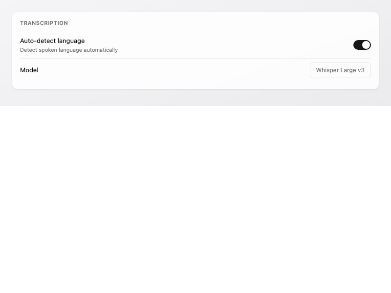 | 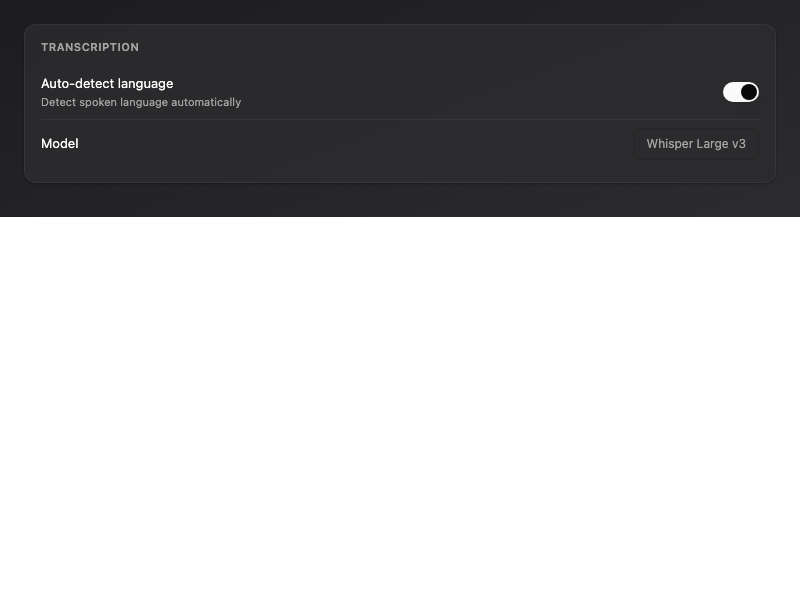 |

```html
<div class="bg-panel-card-bg backdrop-blur border-[0.5px] border-panel-card-border rounded-xl shadow-panel-card p-[14px_16px] mb-2.5">
  <div class="text-[11px] font-semibold uppercase tracking-[0.04em] text-muted-foreground mb-2.5">HEADING</div>
  <!-- content -->
</div>
```

### Form row (label + control)

| Light | Dark |
|---|---|
| 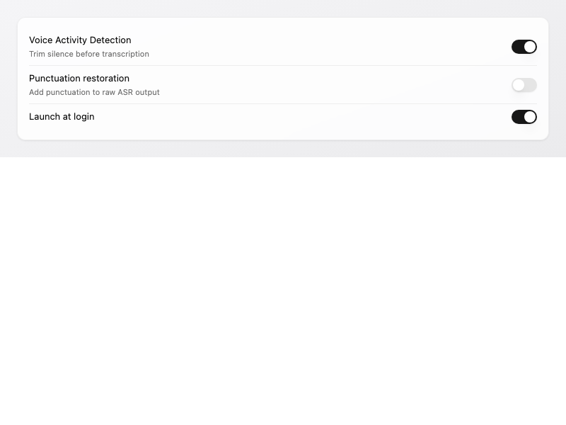 | 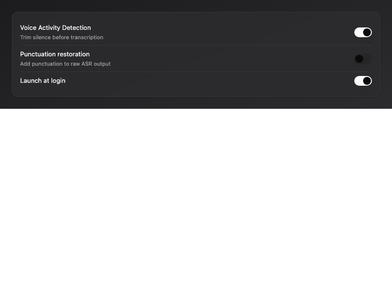 |

```html
<!-- First row: no top border -->
<div class="flex items-center justify-between py-2 gap-3">
  <div>
    <div class="text-[13px] text-foreground">Label</div>
    <div class="text-[11px] text-muted-foreground mt-px">Optional description</div>
  </div>
  <Select .../>
</div>
<!-- Subsequent rows: explicit top divider -->
<div class="flex items-center justify-between py-2 gap-3 border-t-[0.5px] border-panel-divider">
  ...
</div>
```

### History entry card

| Light | Dark |
|---|---|
| 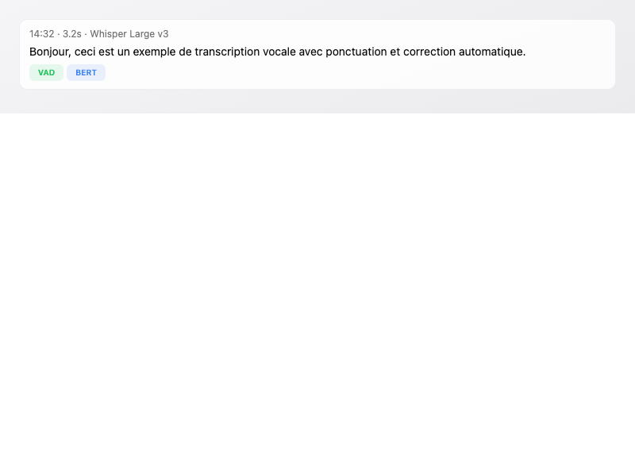 | 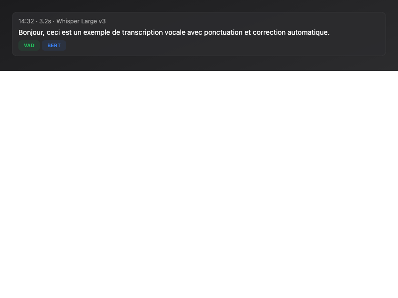 |

```html
<div class="flex items-start gap-2.5 p-[10px_12px] bg-panel-card-bg border-[0.5px] border-panel-card-border rounded-[10px] mb-1.5 transition-shadow duration-150 hover:shadow-panel-card group">
```

### Filter chip (Models)

| Light | Dark |
|---|---|
| 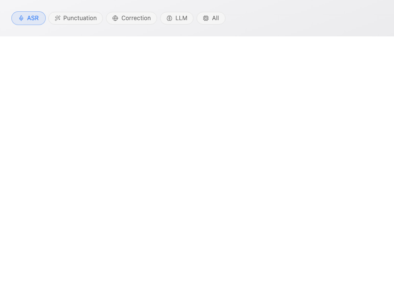 | 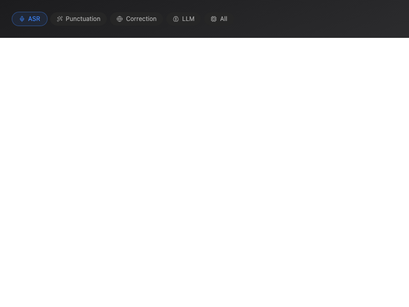 |

```html
<button class="px-3 py-1 rounded-[14px] text-xs cursor-pointer border-[0.5px] border-border transition-all duration-150 font-[inherit] inline-flex items-center gap-1.5"
  :class="[active ? [activeBg, activeText, 'border-transparent', 'ring-1', 'ring-current/20'] : 'bg-muted text-muted-foreground hover:bg-accent hover:text-accent-foreground']">
```

Active colors use `*-500/10` opacity (e.g. `bg-blue-500/10`) — not `*-100` palette which is too strong in light mode.

### Provider row

| Light | Dark |
|---|---|
| 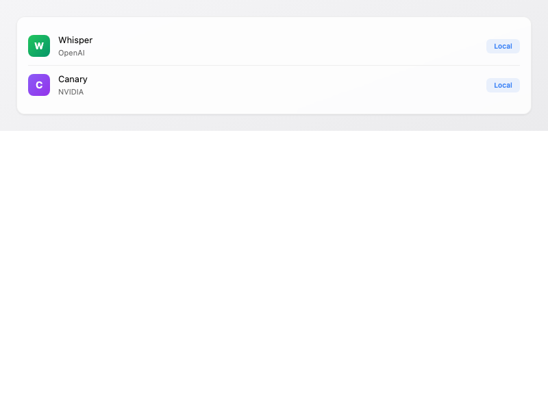 | 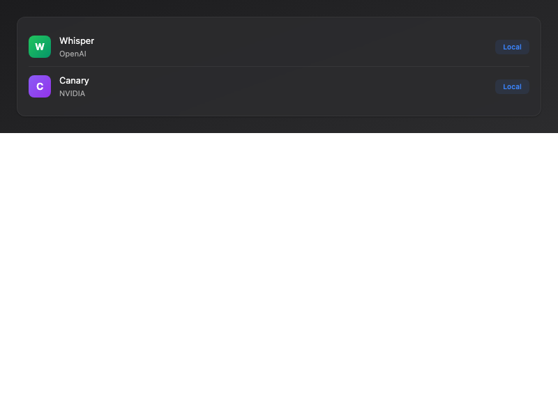 |

```html
<div class="flex items-center gap-3 py-2.5 [&+&]:border-t-[0.5px] [&+&]:border-panel-divider">
```

### About icon

| Light | Dark |
|---|---|
| 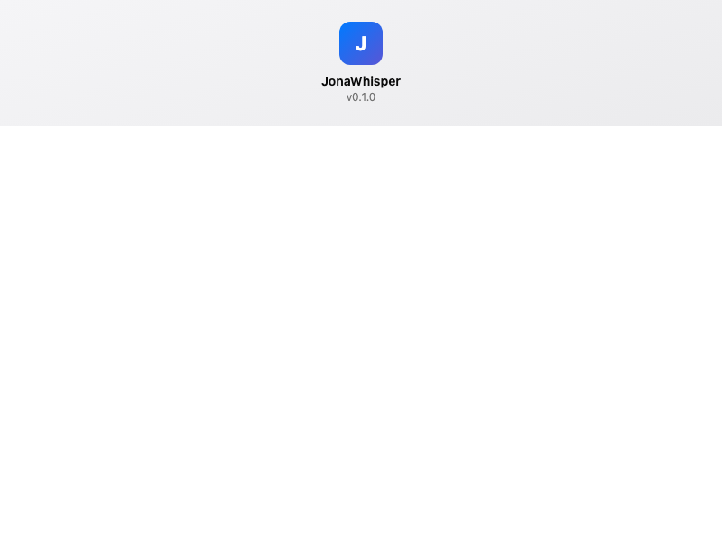 | 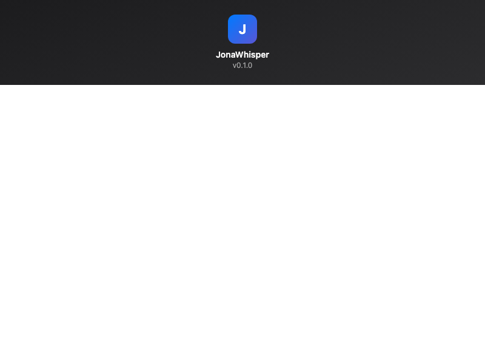 |

```html
<div class="w-12 h-12 mx-auto mb-2 bg-gradient-to-br from-panel-accent to-[#5856d6] rounded-xl flex items-center justify-center text-[22px] font-bold text-white">
```

### Day group (hover to reveal delete)

| Light | Dark |
|---|---|
| 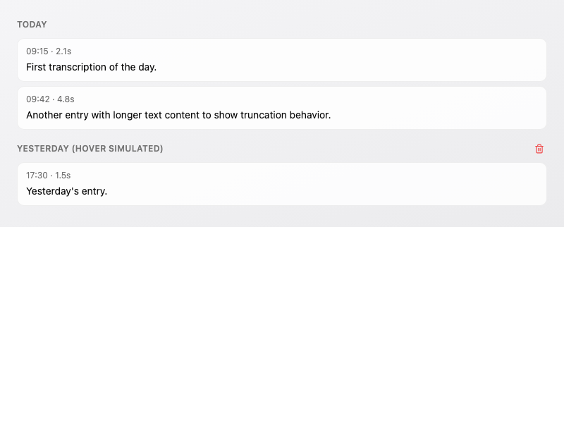 | 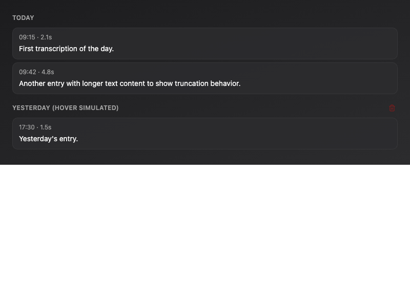 |

```html
<div class="group/day">
  <button class="opacity-0 group-hover/day:opacity-100 transition-opacity duration-150">Delete</button>
</div>
```

## Layout

### Panel (sidebar + content)

The main panel uses inline Tailwind utilities for the three layout zones:

```html
<div class="flex h-full select-none">
  <!-- Sidebar: glassmorphism blur + translucent bg -->
  <div class="backdrop-blur-[20px] backdrop-saturate-[1.8] bg-[hsl(var(--background)/0.72)] dark:bg-[hsl(var(--background)/0.65)] border-r-[0.5px] border-[hsl(var(--border)/0.5)] w-44 min-w-[10rem] flex flex-col flex-shrink-0">
    <!-- nav items -->
  </div>
  <!-- Content: gradient background -->
  <div class="bg-[linear-gradient(160deg,var(--panel-bg-start),var(--panel-bg-end))] flex-1 min-w-0 flex flex-col overflow-hidden">
    <!-- Scrollable body with custom scrollbar -->
    <div class="flex-1 overflow-y-auto px-5 pb-5 [&::-webkit-scrollbar]:w-1.5 [&::-webkit-scrollbar-thumb]:bg-panel-scrollbar [&::-webkit-scrollbar-thumb]:rounded-[3px] [&::-webkit-scrollbar-track]:bg-transparent">
      <!-- section content -->
    </div>
  </div>
</div>
```

### Section title

| Light | Dark |
|---|---|
| 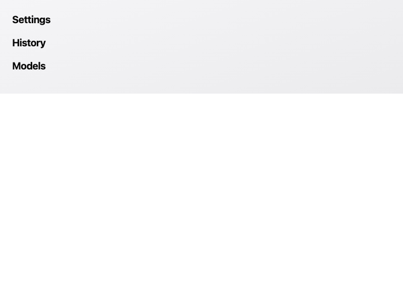 | 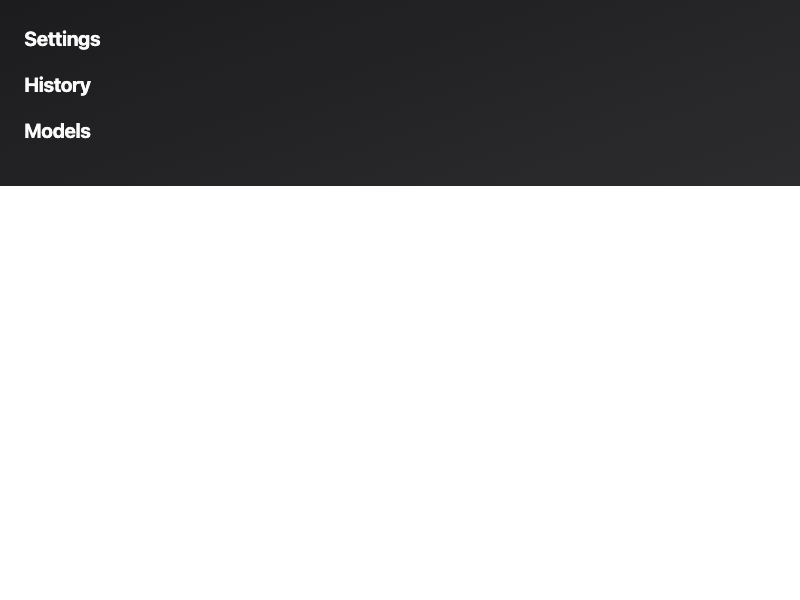 |

Every section starts with:

```html
<div class="text-[20px] font-bold tracking-[-0.02em] mb-4">{{ t('panel.sectionName') }}</div>
```

### Nav pills (sidebar items)

| Light | Dark |
|---|---|
| 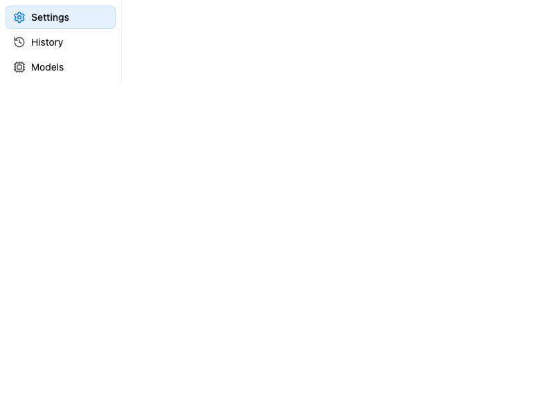 | 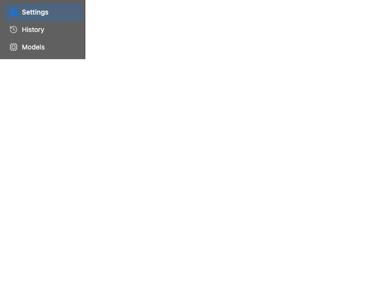 |

```html
<button class="rounded-lg px-2.5 py-1.5 text-sm transition-all border border-transparent hover:bg-sidebar-hover-bg w-full text-left"
  :class="isActive ? 'bg-sidebar-active-bg border-sidebar-active-border font-medium' : ''">
  <Icon class="w-[18px] h-[18px]" :class="isActive ? 'opacity-100 text-panel-accent' : 'opacity-70'" />
  <span>Label</span>
</button>
```

### Status dot (sidebar footer)

| Light | Dark |
|---|---|
| 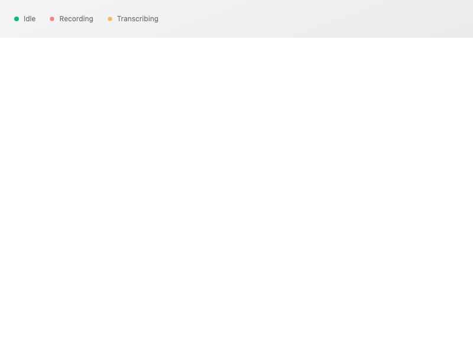 | 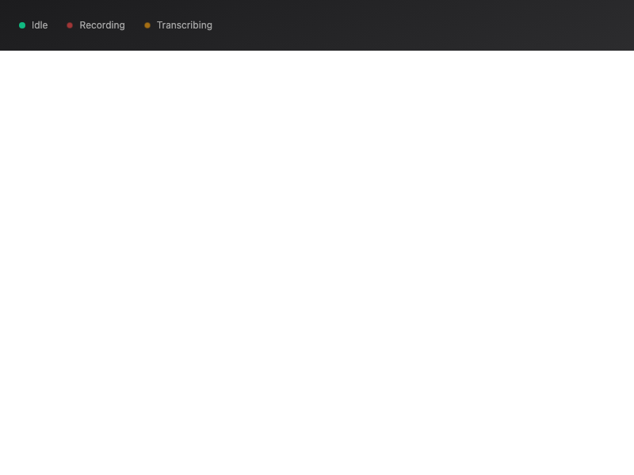 |

```html
<span class="inline-block w-2 h-2 rounded-full"
  :class="{
    'bg-emerald-500': status === 'idle',
    'bg-red-500 animate-status-pulse': status === 'recording',
    'bg-amber-500 animate-status-pulse': status === 'transcribing',
  }" />
```

`animate-status-pulse` is registered in `tailwind.config.ts` (1.2s ease-in-out infinite).

### Header + scrollable content

Used by History:

```html
<div class="flex flex-col h-full select-none">
  <div class="px-5 pt-5 pb-2"><!-- fixed header --></div>
  <div class="flex-1 min-h-0 overflow-y-auto px-5 pb-5"><!-- scrollable --></div>
</div>
```

### Wizard (header + content + fixed footer)

Used by SetupWizard/SetupStep2:

```html
<div class="flex flex-col h-full select-none">
  <div class="text-center px-5 pt-2 pb-3"><!-- header --></div>
  <div class="flex-1 px-5 min-h-0"><!-- content --></div>
  <div class="px-5 pt-3 pb-4 border-t border-border mt-2">
    <Button class="w-full">{{ t('...') }}</Button>
  </div>
</div>
```

### Scrollable flex children

Always `min-h-0` on flex children that need to scroll:

```html
<div class="flex-1 min-h-0 overflow-y-auto">
```

## Components (shadcn-vue)

### Buttons

Use the shadcn `Button` component. Three sizes:

| Size | Height | Usage |
|---|---|---|
| `default` | `h-9` | Primary CTAs (Continue, Save, Start) |
| `sm` | `h-8` | Inline secondary actions (Grant, Download) |
| `icon-sm` | `size-8` | Icon-only actions (delete on hover) |

Three variants:

| Variant | Usage |
|---|---|
| `default` | Primary actions (solid `bg-primary`) |
| `outline` | Secondary actions (Add server, Cancel) |
| `ghost` | Low-emphasis actions (Clear All, Copy, Delete) |

**Destructive actions**: `variant="ghost"` with `class="text-destructive hover:text-destructive"`. In confirmation dialogs:

```html
<AlertDialogAction class="bg-destructive text-destructive-foreground hover:bg-destructive/90">
```

**Full-width CTAs**: add `class="w-full"`.

### Segmented controls

Use `SegmentedToggle.vue` component, or raw `<button>` elements inside a bordered container:

```html
<div class="inline-flex rounded-md border border-border overflow-hidden w-full">
  <button class="flex-1 px-3 py-1.5 text-sm transition-colors"
    :class="isActive ? 'bg-accent text-accent-foreground' : 'hover:bg-accent/50 text-muted-foreground'">
```

Do NOT use `font-medium` on the active state — it shifts the divider.

### Selects

Default height: **`h-8 text-xs`** inside form rows. Search input: `h-8` with icon overlay.

**Important**: always `max-h-[45vh]` on `SelectContent` — Tauri webview is a hard physical boundary, fixed `max-h-96` can overflow when dropdown flips upward.

### Switches

Always inside a form row:

```html
<div class="flex items-center justify-between py-2 gap-3">
  <div class="text-[13px] text-foreground">{{ t('...') }}</div>
  <Switch :model-value="value" @update:model-value="onChange" />
</div>
```

### Badges

Always `variant="secondary"` with color override:

```html
<Badge variant="secondary" class="bg-green-500/10 text-green-500 border-transparent">
```

**Benchmark badges** (BenchmarkBadges.vue) use tier-based colors with dimmed values:

| Tier | Background | Text |
|---|---|---|
| Excellent | `bg-emerald-500/10` | `text-emerald-600` |
| Good | `bg-blue-500/10` | `text-blue-600` |
| Fair | `bg-amber-500/10` | `text-amber-600` |
| Basic | `bg-orange-500/10` | `text-orange-600` |
| Lightning | `bg-violet-500/10` | `text-violet-600` |

### Alert dialogs

Always controlled externally (no `AlertDialogTrigger`):

```html
<AlertDialog :open="showConfirm" @update:open="showConfirm = $event">
  <AlertDialogContent>
    <AlertDialogHeader>
      <AlertDialogTitle>{{ t('...') }}</AlertDialogTitle>
      <AlertDialogDescription>{{ t('...') }}</AlertDialogDescription>
    </AlertDialogHeader>
    <AlertDialogFooter>
      <AlertDialogCancel @click="showConfirm = false">{{ t('...cancel') }}</AlertDialogCancel>
      <AlertDialogAction @click="doAction" class="bg-destructive ...">
        {{ t('...confirm') }}
      </AlertDialogAction>
    </AlertDialogFooter>
  </AlertDialogContent>
</AlertDialog>
```

### Download progress

Progress bars: `w-24`. Speed text: `text-[10px] text-muted-foreground`. No percentage text.

**Optimistic pause transitions**: when the user clicks pause, immediately set `partial_progress` and remove the `activeDownloads` entry in the same synchronous tick to avoid flash.

### Delete indicator

Greyed trash icon + indeterminate progress bar while deleting:

```html
<div class="absolute inset-0 m-auto flex items-center justify-center w-8 h-8">
  <Trash2 class="w-4 h-4 text-muted-foreground/40" />
  <div class="absolute bottom-0.5 left-1 right-1 h-0.5 rounded-full overflow-hidden bg-muted-foreground/15">
    <div class="h-full w-1/3 rounded-full bg-muted-foreground/40 animate-indeterminate" />
  </div>
</div>
```

### Tooltips

Use shadcn-vue `Tooltip` with `delay-duration="300"` everywhere instead of native `title` attribute:

```html
<TooltipProvider>
  <Tooltip :delay-duration="300">
    <TooltipTrigger as-child>
      <Button variant="ghost" size="icon-sm">...</Button>
    </TooltipTrigger>
    <TooltipContent>{{ t('...') }}</TooltipContent>
  </Tooltip>
</TooltipProvider>
```

## Typography

| Style | Tailwind classes | Usage |
|---|---|---|
| Section title | `text-[20px] font-bold tracking-[-0.02em] mb-4` | Panel section headings |
| Card heading | `text-[11px] font-semibold uppercase tracking-[0.04em] text-muted-foreground mb-2.5` | Card section labels |
| Form label | `text-[13px] text-foreground` | Setting labels |
| Form description | `text-[11px] text-muted-foreground mt-px` | Setting descriptions |
| Wizard title | `text-lg font-bold` | Setup wizard `<h1>` |
| Nav item | `text-sm` (via nav pill pattern) | Sidebar items |
| Body text | `text-sm` | General content |
| Metadata | `text-xs text-muted-foreground` | Timestamps, secondary info |
| Sub-metadata | `text-[11px] text-muted-foreground` | Model sizes in dense lists |
| Badge text | `text-[10px]` | Benchmark badges |
| Validation error | `text-xs text-destructive` | Form field errors |

## Icons

Use **`lucide-vue-next`** exclusively. Named imports only:

```ts
import { Search, Copy, Check, Trash2 } from 'lucide-vue-next'
```

Four sizes:

| Classes | Usage |
|---|---|
| `w-5 h-5` | Large / hero icons |
| `w-4 h-4` | Standard inline icons, nav icons |
| `w-3.5 h-3.5` | Compact icons (history actions, search) |
| `w-3 h-3` / `w-2.5 h-2.5` | Small icons (badge checkmarks, indicators) |

## Animations

| Name | Duration | Used for |
|---|---|---|
| `.fade-enter/leave` | 200ms ease | Section transitions (Panel tabs) |
| `.status-pulse` | 1.2s infinite | Recording/transcribing status dot |
| `.captureFlash` | 1s infinite | Shortcut capture waiting hint |
| `.animate-indeterminate` | 1.5s infinite | Model delete progress bar |
| `transition-[height] duration-75` | 75ms | Spectrum bar height changes |

## i18n

- All visible text through `t()` (Vue) or `t!()` (Rust)
- Never hardcode user-facing strings
- Keys follow dot notation: `section.subsection.key`
- Both `en.json` and `fr.json` must stay in sync
- Don't create i18n keys speculatively — only add when actually used

## Rules

1. **`h-full`, never `h-screen`** — `h-screen` overflows the Tauri webview
2. **`select-none`** on all interactive view roots — native app feel
3. **Don't call `fetchAudioDevices()` on mount** — triggers macOS mic permission dialog
4. **Semantic colors only** — never hardcode hex/rgb in templates
5. **Use the Tailwind utility patterns above for cards and forms** — keep styling consistent across sections
6. **No `font-medium` on toggle active states** — shifts the divider
7. **Adjust window sizes when changing padding** — SetupWizard has fixed sizes (420x450 step 1, 680x540 step 2)
8. **Scrollable content needs `pb-5`** — bottom padding so content doesn't clip
9. **Ghost buttons for secondary destructive actions** — no borders, just `text-destructive`
10. **Raw `<button>` for nav and toggles** — not `<div @click>`, for accessibility
11. **No unused i18n keys** — delete keys when removing the UI that uses them
12. **`max-h-[45vh]` on SelectContent** — prevents overflow in Tauri webview
